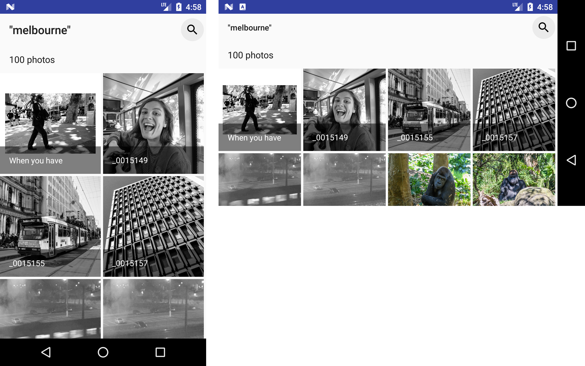

# flickr-android

A small sample app to showcase architecting app using Clean Architecture and MVVM

## Does it support tablet UI as well as UI for different orientation?

Yes. On phone devices, the gallery will show photos in a grid of 2 columns in portrait. But in landscape, column count will be 4.

For tablet devices, more column will be added.

## Does it handle configuration changes?

Yes. For example, when you rotate the device from portrait to landscape, the app won't fetch photos from Flickr again. I used the approach of using retained fragments which is mentioned in https://developer.android.com/guide/topics/resources/runtime-changes.html#RetainingAnObject.

## Does it have a good architecture?

I used Clean Architecture and MVVM to drive a scalable, testable code-base. The project is divided into 3 modules:

* **domain**: Contains components to perform business logic like Repository interfaces (e.g. `PhotoRepository`, `QueryRepository`), and interactors (e.g. `GetPhotos`). This module is completely independent from Android SDK. So that makes sure that any changes, for example, related to changing network layer, or data storage will not affect this business layer. Executing unit tests is fast because it's just a Java/Kotlin module.
    - Main technologies: Kotlin, RxJava.
* **data**: Contains implementations of the Repository interfaces from the domain module. This module depends on Android SDK. This is where I implemented networking layer to access Flickr's public API as well as SQLite-related storage layer to store fetched photos.
    - Main technologies: Retrofit, Immutables, Gson, OkHttp, Room and RxJava.
* **app**: Basically, a presentation layer. This place is where MVVM comes to play. This module contains view controllers (e.g. `RecentPhotosFragment`) and ViewModels (e.g. `RecentPhotosViewModel`). ViewModels are absolutely testable.
    - Main technologies: Data Binding Library, RxJava and RxAndroid.

On top of that, package hierarchy is organized by features: core, recent, and photodetails.

To understand more about this Clean Architecture approach, you can read further in following links:

* https://github.com/skedgo/android-documentation/blob/master/architecture/architectural-overview.md. This is written by me for the team at SkedGo.
* https://thuytrinh.github.io/clean-architecture/2017/03/25/some-resources-android-clean-architecture.html.

## Does it have unit tests?

Yes, however as I don't have much time, I only covered few most important classes which are:

* `PhotoRepositoryImpl`
* `RecentPhotosViewModel`
* `QueryRepository`

Unit tests for the remaining classes can be written in the same way as those 3 classes.

## Does it have a good way to send data across Activities?

Yes. To show a higher resolution photo, `PhotoDetailsActivity` only takes a photo id from `RecentPhotosActivity`. This is to avoid the `TransactionTooLargeException` which easily happens since Android 7 if we send a large amount of data between Android components. That photo id is then used to retrieve more infos about photo via `PhotoRepository`. `PhotoRepository` is backed behind by a good caching mechanism. After we fetch a list of photos from Flickr, they will be put into a memory cache to quickly access later on `PhotosDetailsActivity`. However, if somehow the app is killed by the system after being pushed into background, given a photo id, the app can retrieve the photo back via a SQLite-based database (implemented via Room).
